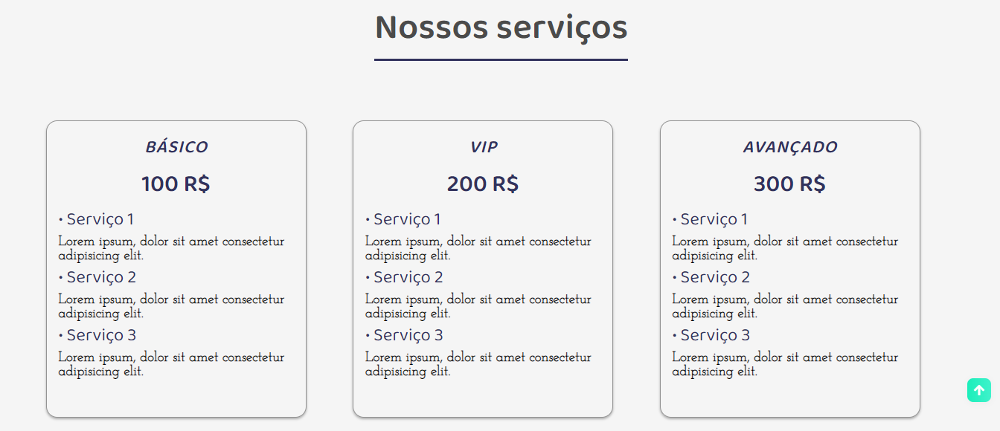

# Base website for accounting office

<!---Esses são exemplos. Veja https://shields.io para outras pessoas ou para personalizar este conjunto de escudos. Você pode querer incluir dependências, status do projeto e informações de licença aqui--->

> Site base para escritório de contabilidade.

### Ajustes e melhorias

O projeto ainda está em desenvolvimento e as próximas atualizações serão voltadas nas seguintes tarefas:

- [x] Corpo com HTML.
- [x] Estilização com CSS.
- [x] Troca de classes com JavaScript para o menu Hamburguer e para o Formulário de Contato.
- [x] Responsividade
- [x] Responsividade
- [ ] Novas seções

## 🤝 Colaborador

<table>
  <tr>
    <td align="center">
      <a href="#">
         
        
          <b>João Guilherme</b>
        
      </a>
    </td>
  </tr>
</table>

## Tecnologias
Tecnologias usadas no projeto:

 
